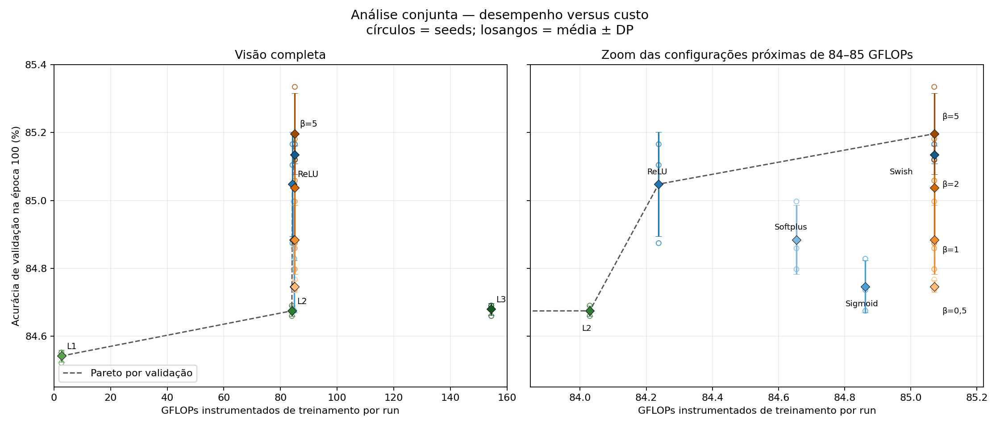

# Adult + q01 — funções de ativação em NumPy/CPU

Estudo dirigido de Reconhecimento de Padrões 2026.1 sobre classificação binária
do conjunto Adult. O experimento investiga se a formulação da ativação oculta
altera a acurácia e o retorno por FLOP de uma MLP.

O núcleo neural e o autograd usam NumPy/CPU; Matplotlib é usado para os
gráficos. Este trabalho foi construído sobre o
[BERT-cpu original](https://github.com/luisfilipeap/BERT-cpu).

## Resultado em uma frase

As ativações alteraram acurácia e custo, mas nenhuma função suave superou a
ReLU pelo ganho relevante pré-definido de `0,5` ponto percentual. `S-BETA-5`
teve a maior validação, `L1-DIRECT` o melhor retorno por FLOP e `F-RELU` foi a
escolha sob o orçamento computacional da baseline.



## Tarefa e baseline

- Dataset: Adult, classificação de renda `<=50K` ou `>50K`.
- Entrada: 14 atributos brutos transformados em 108 features.
- Saída: dois logits, um por classe.
- Treino oficial: 32.561 amostras, divididas em 26.049 para treino e 6.512 para
  validação.
- Teste oficial: 16.281 amostras.
- Objetivo: minimizar cross-entropy.
- Métrica principal: média da acurácia de validação na época 100.
- Baseline: `Linear(108,64) -> ReLU -> Linear(64,2)`, com 7.106 parâmetros.

## Protocolo

| Controle | Valor |
|---|---|
| Treinamento | full-batch, Adam, `lr=0,01`, 100 épocas |
| Hold-out | 20%, materializado uma vez com seed 0 |
| Seeds do modelo | 0, 1 e 2 |
| Escala | 11 configurações e 33 runs primárias |
| Verificação extra | repetição determinística de `F-RELU`, seed 0 |
| Ganho relevante | `0,5` p.p. e mesmo sinal em pelo menos duas seeds |
| Seleção | validação na época 100; menor custo e parâmetros como desempate |
| Teste | somente depois de congelar hipóteses e decisões |

Os custos são sempre **FLOPs instrumentados**. Eles incluem os forwards, losses
e backward das multiplicações matriciais na janela definida, mas não representam
tempo, energia, memória, backward elementwise ou custo completo do Adam.

## Variáveis investigadas

### V1 — família da ativação

Mesma MLP `108 -> 64 -> 2`, alterando apenas `h = g(z)`:

| ID | Formulação |
|---|---|
| `F-RELU` | `max(0,z)` |
| `F-SIGMOID` | `1 / (1 + exp(-z))` |
| `F-SWISH` | `z * sigmoid(z)` |
| `F-SOFTPLUS` | `log(1 + exp(z))` |

### V2 — curvatura da Softplus

```text
softplus_beta(z) = log(1 + exp(beta*z)) / beta
```

Foram usados `beta = 0,5`, `1`, `2` e `5`. Beta é fixo e não aprendível.

### V3 — profundidade linear sem ativação

| ID | Arquitetura | Parâmetros |
|---|---|---:|
| `L1-DIRECT` | `Linear(108,2)` | 218 |
| `L2-IDENTITY` | `Linear(108,64) -> Linear(64,2)` | 7.106 |
| `L3-IDENTITY` | `Linear(108,64) -> Linear(64,64) -> Linear(64,2)` | 11.266 |

Não existe uma camada Identity artificial: as camadas lineares são conectadas
diretamente. A composição continua equivalente a uma única função afim
`W*x+b`, embora parametrização, otimização, parâmetros e FLOPs mudem. V3 mantém
o risco de ser interpretada como variável arquitetural, e não como terceira
variável de q01; não houve confirmação do professor sobre esse enquadramento.

## Resultados

As médias usam as três seeds. O teste é somente descritivo e não participou de
seleção, Pareto ou avaliação das hipóteses.

| Configuração | Validação | Teste* | GFLOPs/run | Retorno | Estado global |
|---|---:|---:|---:|---:|---|
| `S-BETA-5` | 85,1966% | 85,5414% | 85,0711121 | 0,113722 | Pareto |
| `F-SWISH` | 85,1351% | 85,5967% | 85,0711121 | 0,113000 | Dominada |
| `F-RELU` | 85,0481% | 85,4780% | 84,2375505 | 0,113085 | Pareto |
| `S-BETA-2` | 85,0379% | 85,6458% | 85,0711121 | 0,111857 | Dominada |
| `F-SOFTPLUS` | 84,8843% | 85,3735% | 84,6543313 | 0,110593 | Dominada |
| `S-BETA-1` | 84,8843% | 85,3735% | 85,0711121 | 0,110051 | Dominada |
| `F-SIGMOID` | 84,7461% | 85,2527% | 84,8627217 | 0,108693 | Dominada |
| `S-BETA-0.5` | 84,7461% | 85,2814% | 85,0711121 | 0,108427 | Dominada |
| `L3-IDENTITY` | 84,6796% | 85,2343% | 154,4654481 | 0,059285 | Dominada |
| `L2-IDENTITY` | 84,6744% | 85,2466% | 84,0291601 | 0,108919 | Pareto |
| `L1-DIRECT` | 84,5414% | 85,1135% | 2,6107501 | 3,454657 | Pareto |

\* Teste oficial apenas descritivo.

Tabela com desvios, pares brutos, marginais e interpretação completa:
[análise conjunta](experiments/final_analysis/analysis.md).

### Hipóteses

| Hipótese | Resultado |
|---|---|
| H1a — uma suave supera ReLU por 0,5 p.p. | Inconclusiva |
| H1b — Sigmoid fica 0,5 p.p. abaixo da ReLU | Inconclusiva |
| H1c — ReLU tem o menor custo da V1 | Sustentada |
| H2 — melhor beta central supera melhor extremo | Inconclusiva |
| H3a — profundidade linear não melhora L1 por 0,5 p.p. | Não contradita |
| H3b — parâmetros e FLOPs crescem com a profundidade | Sustentada |
| H3c — retorno segue L1 > L2 > L3 | Sustentada |
| H3d — ReLU supera L2 por 0,5 p.p. | Inconclusiva |

### Quatro respostas de trade-off

1. Melhor retorno por FLOP: `L1-DIRECT`, com `3,454657 p.p./GFLOP`.
2. Ganhos abaixo do limiar já aparecem em `L1 -> L2`. Dentro de V3, o retorno
   marginal cai novamente em `L2 -> L3`; globalmente não há um único cotovelo
   monotônico.
3. V3 adicionou `151,854698 GFLOPs` de L1 a L3 para apenas `0,138206 p.p.`.
   No sentido contrário, V2 variou `0,450450 p.p.` sem alterar o custo entre
   seus níveis, ainda abaixo do limiar relevante.
4. Sob o orçamento da ReLU (`84,2375505 GFLOPs`), a escolha é `F-RELU`, com
   85,0481% de validação. Para eficiência absoluta, a escolha seria L1.

## Instalação

Ambiente registrado: Python 3.11.14, NumPy 2.1.3, Matplotlib 3.9.2 e
pytest 8.3.4.

```bash
git clone https://github.com/JorgRibeiro/BERT-cpu.git
cd BERT-cpu
git switch q01-ativacoes-adult

python3.11 -m venv .venv
source .venv/bin/activate
python -m pip install --upgrade pip
python -m pip install -r requirements.txt
```

Os arquivos Adult necessários já estão em `datasets/adult/`.

## Reprodução segura dos resultados publicados

Esta sequência não treina modelos e não carrega novamente o Adult test:

```bash
# Validar os quatro artefatos oficiais já salvos
python -m experiments.evaluate_official_test --verify-only

# Testar que a análise bloqueia loader, treino, forward e reavaliação
pytest -q test/test_plot_joint.py

# Regenerar o gráfico das funções, tabelas e gráficos experimentais
python -m exercises.q01_activations
python -m experiments.plot_v1
python -m experiments.plot_v2
python -m experiments.plot_v3
python -m experiments.plot_joint

# Conferência final, ainda sem carregar o teste
python -m experiments.evaluate_official_test --verify-only
```

Resultado esperado do teste focado: `6 passed`. O comando `--verify-only`
apenas lê e valida manifestos, log, CSV e hashes. A avaliação que carregaria o
teste não é parte da reprodução final.

A suíte ampla de desenvolvimento alcançou historicamente 286 testes permitidos,
com `test/test_model.py` excluído por quatro placeholders Transformer. Ela não é
usada na reprodução acima: inclui treinos curtos e um teste de loader que acessa
`adult.test`. Esse acesso não executa checkpoints nem participa das conclusões.

## Reexecução opcional dos treinamentos

Faça isso somente em um checkout limpo da branch e em diretórios vazios. Estes
comandos repetem as 33 runs primárias e a repetição determinística da ReLU em
CPU, mas não avaliam o teste oficial.

```bash
Q01_REPRO_DIR=/tmp/bert-cpu-q01-reproduction
mkdir -p "$Q01_REPRO_DIR/v1" "$Q01_REPRO_DIR/v2" "$Q01_REPRO_DIR/v3"

# V1: baseline, repetição determinística e demais seeds
python -m experiments.run_v1 --config-id F-RELU --seed 0 --repetition 1 \
  --artifacts-dir "$Q01_REPRO_DIR/v1" --quiet
python -m experiments.run_v1 --config-id F-RELU --seed 0 --repetition 2 \
  --artifacts-dir "$Q01_REPRO_DIR/v1" --quiet

for seed in 1 2; do
  python -m experiments.run_v1 --config-id F-RELU --seed "$seed" \
    --artifacts-dir "$Q01_REPRO_DIR/v1" --quiet
done

for config in F-SIGMOID F-SWISH F-SOFTPLUS; do
  for seed in 0 1 2; do
    python -m experiments.run_v1 --config-id "$config" --seed "$seed" \
      --artifacts-dir "$Q01_REPRO_DIR/v1" --quiet
  done
done

# V2 e V3: planos congelados de 12 e 9 runs
python -m experiments.run_v2_all \
  --artifacts-dir "$Q01_REPRO_DIR/v2" --quiet
python -m experiments.run_v3_all \
  --artifacts-dir "$Q01_REPRO_DIR/v3" --quiet
```

Regere as análises de validação desses novos diretórios:

```bash
python -m experiments.plot_v1 \
  --results "$Q01_REPRO_DIR/v1/results.csv" \
  --summary "$Q01_REPRO_DIR/v1/summary.csv" \
  --plots-dir "$Q01_REPRO_DIR/v1/plots"

python -m experiments.plot_v2 \
  --results "$Q01_REPRO_DIR/v2/results.csv" \
  --summary "$Q01_REPRO_DIR/v2/summary.csv" \
  --plots-dir "$Q01_REPRO_DIR/v2/plots"

python -m experiments.plot_v3 \
  --results "$Q01_REPRO_DIR/v3/results.csv" \
  --v1-results "$Q01_REPRO_DIR/v1/results.csv" \
  --summary "$Q01_REPRO_DIR/v3/summary.csv" \
  --plots-dir "$Q01_REPRO_DIR/v3/plots"
```

A análise conjunta publicada continua ligada à avaliação oficial selada. Use
`--verify-only` para auditar a avaliação e o teste focado mais o gerador para
auditar a análise; não reavalie o teste para escolher ou ajustar configurações.

## Organização dos artefatos

| Caminho | Conteúdo |
|---|---|
| [`experiments/configs/`](experiments/configs/) | protocolos congelados |
| [`experiments/hypotheses.md`](experiments/hypotheses.md) | hipóteses pré-experimentais |
| [`experiments/analysis.md`](experiments/analysis.md) | análise da V1 |
| [`experiments/v2/`](experiments/v2/) | protocolo, runs e análise da V2 |
| [`experiments/v3/`](experiments/v3/) | protocolo, runs e análise da V3 |
| [`experiments/final_evaluation/`](experiments/final_evaluation/) | avaliação oficial selada |
| [`experiments/final_analysis/`](experiments/final_analysis/) | síntese, pares, Pareto e gráficos |
| [`experiments/ai_usage.md`](experiments/ai_usage.md) | uso e verificação da IA |
| [`experiments/video_evidence.md`](experiments/video_evidence.md) | mapa das evidências do vídeo |
| [`experiments/video_script.md`](experiments/video_script.md) | roteiro cronometrado de 19min20s |

## Limitações

- Três seeds no mesmo split medem variação de inicialização, não de amostragem;
  os desvios não são intervalos de confiança.
- O encoder foi ajustado em todo `adult.data` antes do hold-out, usando features
  da futura validação sem seus rótulos.
- FLOPs instrumentados não representam tempo, energia, memória ou custo total.
- V3 muda profundidade, parâmetros e geometria de otimização e pode ser
  interpretada como variável arquitetural fora de q01.
- A ponte ReLU–L2 atravessa commits e kernels diferentes.
- O avaliador oficial registrou um único carregamento controlado do teste. Uma
  suíte ampla executada depois também chamou o loader para conferir forma,
  labels e espaço de features; esse acesso não gerou métricas de modelos nem
  alterou hipóteses, Pareto ou seleção.

## Uso de IA

A IA ajudou a estruturar o protocolo, implementar operações e executores,
produzir testes e consolidar artefatos. As decisões de escopo, variáveis,
hipóteses, três seeds, cancelamento do extra de 1000 épocas e autorizações de
commit foram do estudante. O registro detalhado está em
[`experiments/ai_usage.md`](experiments/ai_usage.md).

## Entrega

- Repositório: <https://github.com/JorgRibeiro/BERT-cpu>
- Vídeo de até 20 minutos: pendente de gravação e inclusão do link.
- Envio final: Classroom.
