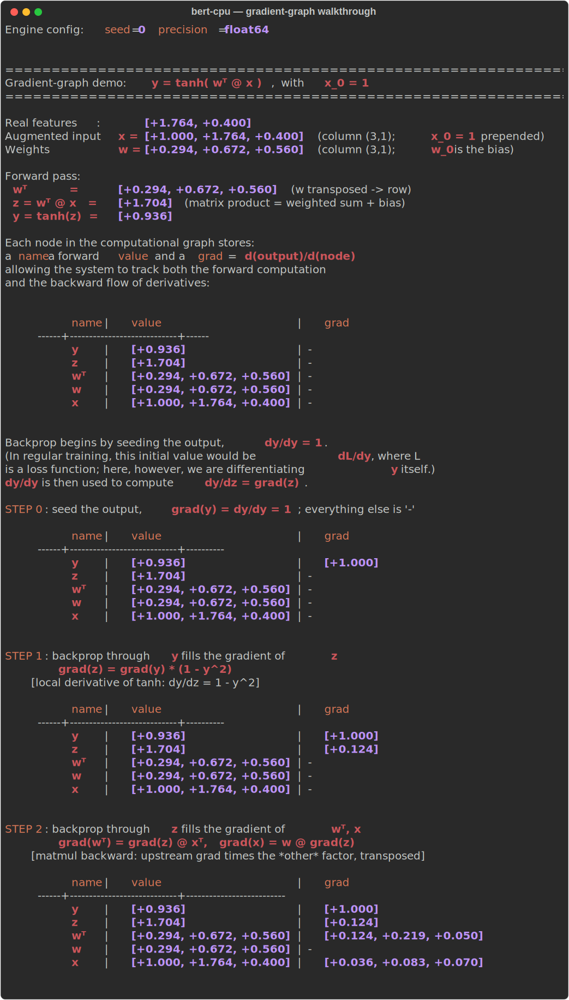

# BERT-CPU

> *"What I cannot create, I do not understand."*  
> — Richard Feynman

This project is built in that spirit: the surest way to understand BERT is to
build it from scratch. Here, *from scratch* is meant literally — **NumPy is the
only dependency, used only as an array computation backend**.

## What is BERT-cpu?

BERT-cpu is a NumPy-only, CPU-only environment for learning how a BERT-style
model is built and trained *from the autograd level up* — no GPUs, no CUDA, no
heavyweight framework. It favours **clarity, reproducibility and
inspectability** over raw performance. **Our engine is deliberately not meant to compete with PyTorch, TensorFlow, JAX or any other Deep Learning framework**.

Its real strength is that it makes the **learning machinery visible**. For example, the didactic walkthrough turns the autograd engine inside out: it prints the
computational graph as a table, shows every node's forward value, then
**animates backpropagation step by step** — filling in each gradient with the
exact chain-rule formula used, all the way from the output seed back to the
inputs. The maths of training a network stops being a black box and becomes
something you can read line by line:



## Who is it for?

### For students

- **A democratic way to learn the maths.** See the full mathematics of training
  a network on any laptop — no GPU, CUDA, or cloud budget required. **The barrier to understanding deep learning becomes curiosity, not expensive hardware: the maths is the point, the hardware is not**.
- Study how a network is differentiated **from first principles**, seeing how a   `Tensor` stores its value, gradient, parent nodes, op label, and local   backward function.
- Watch the **computational graph** get built during the forward pass, and flow backward, one node at a time, with the chain-rule formula shown at each step.
- Connect mathematical formulas directly to executable NumPy code.

### For teaching

- Use the step-by-step walkthrough as a lecture artifact for courses on
  automatic differentiation, deep-learning fundamentals, and (as the higher
  layers land) Transformer models.
- Demonstrate each engine operation independently before assembling larger
  computations.
- Build exercises where students modify a single op or backward rule and
  immediately observe the effect on the gradients.
- Debug student implementations by comparing **analytic vs numerical**
  gradients.
- Choose the precision and RNG seed of the demo on the command line, so the
  same walkthrough can be shown under different settings
  (`python -m test.test_engine --precision float32 --seed 0`).

### For research & reproducible experiments

- **Reproducibility:** one global seed (`bert_cpu.set_seed(0)`) makes a whole run
  repeatable end to end, with far fewer sources of randomness than large-scale
  GPU training.
- **Precision control:** run the engine in float64 (stable, default) or
  float32/float16 to study the numerical behaviour of an idea.
- **Minimal stack:** only NumPy — no CUDA versions, GPU kernels, or distributed
  setup to reproduce, so experiments are easy to replicate on common hardware.
- **Full inspectability:** the entire computational path (values *and*
  gradients) is visible, which makes failures and learning dynamics easy to
  examine in small, controlled toy settings.
- Validate that an idea is **mathematically and computationally sound** in a
  transparent setting before investing in a large-scale implementation.

## Requirements

- Python >= 3.8
- NumPy (the only runtime dependency)

## Setup

Create a virtual environment and install the dependencies:

```bash
# Create the virtual environment
python3 -m venv .venv

# Activate it
source .venv/bin/activate        # Linux / macOS
# .venv\Scripts\activate         # Windows (PowerShell)

# Install the dependencies
pip install --upgrade pip
pip install -r requirements.txt
```

> **Note:** if `python3 -m venv` fails with an `ensurepip is not available`
> error, your interpreter is missing the `venv` module. On Debian/Ubuntu install
> it with `apt install python3-venv`, or use a `pyenv`-managed Python.

## Learning path (start here)

This project is meant to be *read and run* from the ground up. Everything BERT
does eventually reduces to one idea: a graph of tensor operations through which
gradients flow backward. So the very first thing to understand — right after
installing — is **how the autograd engine works**.

**Step 1 — see the gradient engine in action.** With the virtual environment
activated, run *only* the engine's didactic demo:

```bash
pip install pytest                                          # if not done yet
pytest -s -k demo test/test_engine.py
```

- `-s` lets the demo print to your screen (pytest hides output otherwise).
- `-k demo` selects only the walkthrough test (`test_demo_gradient_graph_runs`).
- `test/test_engine.py` restricts the run to the engine file.

You can get the same output by running the file as a module from the project
root (use `-m` so `bert_cpu` is importable — running the path directly is not):

```bash
python -m test.test_engine
```

This standalone run also lets you choose the numerical precision and the RNG
seed, so you can watch the same walkthrough under different settings and get
reproducible numbers:

```bash
python -m test.test_engine --precision float32 --seed 0
python -m test.test_engine --precision float16 --seed 42
```

- `--precision` picks the engine's float dtype (`float16` / `float32` /
  `float64`; default `float64`).
- `--seed` seeds NumPy's RNG so the run is reproducible (default `0`).

What you will see, and what to take away from it:

1. **An input column vector** `x` and a **weight column vector** `w`. The demo
   uses the "bias trick": the input is *augmented* with a leading constant
   `x_0 = 1`, so `w_0` plays the role of the bias.
2. **The forward pass** of a tiny linear layer, computing `z = wᵀ @ x` (a matrix
   multiplication) and then `y = tanh(z)`, step by step.
3. **The computational graph as a table**, one row per node (output on top,
   inputs at the bottom), each annotated with its forward `value` and its
   `grad`.
4. **The backward pass, animated step by step.** Each step fills in one node's
   gradient and prints the local derivative rule it used (for the `tanh`, the
   matmul `@`, and the transpose), so you watch the chain rule propagate from
   the output seed back to every input.

Read the graph from the top down to follow the forward pass, then read the
gradients to see how `backward()` distributes the chain rule from the output
back to every input. Once that "click" happens, the rest of the library
(layers, attention, the full encoder) is just *bigger graphs of the same kind*.

**Step 2 — confirm the engine is correct.** Run the engine's software tests
(broadcasting, matmul, softmax, finite-difference gradient checks):

```bash
pytest test/test_engine.py
```

From here you are ready to explore the higher-level modules. The full testing
reference is in [Tests and didactic walkthroughs](#tests-and-didactic-walkthroughs).

## Usage

With the virtual environment activated, import the library from the project
root. The package directory is `bert_cpu` (underscore — the importable name),
while the distribution is named `bert-cpu`.

What works today is the autograd engine — build an expression out of `Tensor`s
and differentiate it with `backward()`:

```python
import bert_cpu

bert_cpu.set_seed(0)                       # reproducible run

x = bert_cpu.Tensor([[2.0], [-3.0]])   # input column vector (2, 1)
w = bert_cpu.Tensor([[0.5], [1.5]])    # weight column vector (2, 1)
y = (w.T @ x).tanh()                   # forward pass: a tiny linear unit

y.backward()                           # reverse-mode autodiff
print(x.grad, w.grad)                  # gradients dy/dx, dy/dw
```

> The higher-level pieces (`BERTModel`, `Linear`, `MultiHeadAttention`,
> optimizers, losses, tokenizer) are scaffolded but not implemented yet — see
> **Current status** above.

## Tests and didactic walkthroughs

The test suite serves two purposes, kept side by side in the same files:

1. **Software tests** — ordinary correctness checks (broadcasting, matmul,
   softmax, finite-difference gradient checks, etc.).
2. **Didactic walkthroughs** — runnable demos that *print to the console* to
   teach what is happening internally, e.g. drawing the computational graph and
   showing how reverse-mode autodiff propagates the chain rule from the output
   back to the inputs.

First install the test dependency (already covered if you ran the setup above):

```bash
pip install pytest
```

### Run the software tests

```bash
pytest                       # run everything quietly
pytest -v                    # verbose, one line per test
pytest test/test_engine.py   # just the autograd-engine tests
```

### Run the didactic walkthroughs

The walkthroughs print explanatory output, so run them with `-s` (so pytest does
not capture stdout) and select them with `-k demo`:

```bash
pytest -s -k demo                       # every didactic walkthrough
pytest -s -k demo test/test_engine.py   # only the engine's gradient-graph demo
```

Each walkthrough is also runnable as a module for a clean, standalone view
(run it with `-m` from the project root, not by path). For example, the
gradient-graph demo (input vector → forward pass → ASCII graph annotated with
gradients → chain-rule check), optionally choosing the precision and seed:

```bash
python -m test.test_engine                               # defaults: float64, seed 0
python -m test.test_engine --precision float32 --seed 0  # pick dtype and seed
```

> New here? Follow the [Learning path](#learning-path-start-here) above — it
> walks you through this engine demo first, since every other module is built
> on top of it.
